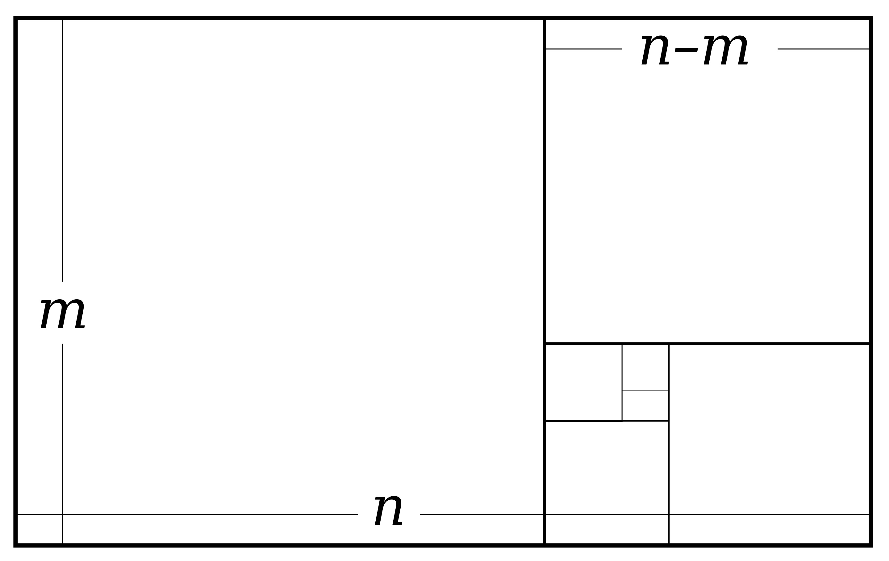
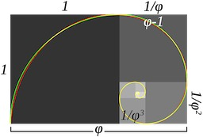

## What is the Golden Ratio?

$$\phi = (a + b)/a = a/b$$ 

`1.61803398849...`

You may also recocgnize the fibonaccie sequence 

1, 1, 2, 3, 5, 8, 13, 21, 34, 55...
In each case the value of the current number is the sum of the two previous values.

Romans Loved the `3:5` ratio, for example.

## Famous Example: Da Vinci Vitruvian Man

