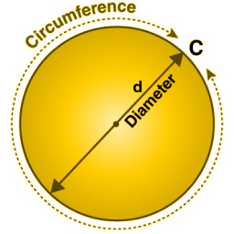

## The Pathagorean Theorem

$$A^2+B^2=C^2$$


## What is Pi or $$\pi$$

pi is a constant that is used in circle math `3.141592653589793...`

For most people `3.14` is all they need

## Radius ( $$r$$ )




in several functions we see raidius or `r`

This means `1/2`of the circle's diameter

$$1/2*D$$

## Area of a Circle

$$\pi*r^2$$

## Diameter of a Cicle

$$2*\pi*r$$

The LaTeX commands for the basic trigonometric functions are as follows:

- Sine: $$\sin(x)$$
- Cosine: $$\cos(x)$$
- Tangent: $$\tan(x)$$
- Cosecant: $$\csc(x)$$
- Secant: $$\sec(x)$$
- Cotangent: $$\cot(x)$$

For the inverse trigonometric functions, you can use:

- Arcsine: $$\arcsin(x)$$
- Arccosine: $$\arccos(x)$$
- Arctangent: $$\arctan(x)$$

$$\sin^2(x)$$

And for tangent cubed:

$$\tan^3(x)$$


```
// ZB-I should check this
```

$$\sin(\theta)^2 + \cos(\theta)^2 = 1$$
