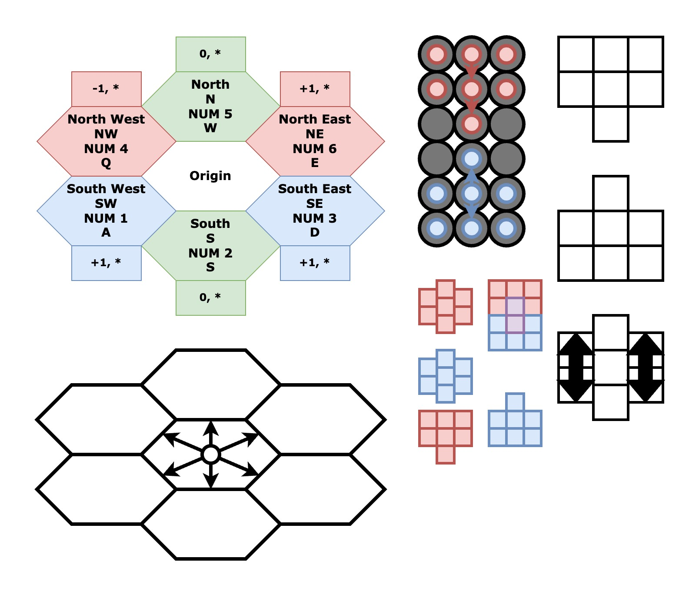

# Towne of Clock (ToK) Game Design Doc

### 1.1 Scope

Tbd 

### 1.2 Elevator Pitch

A world divided into newtons ROYGBIV color spectrum and ruled by an evil emperor.

### 2.1 Game Concept

An idle skill RPG — craft & battle with a few puzzle elements thrown in.

- Players craft or equipped skills
  - Passive Skills are always active
    - I have +1 HP max
    - I do +1 Heat damage on strike
  - Active Skills are selectively used
    - My gun has a bolt skill that requires a target and deals 3 Heat damage when used.
- Players farm materials for crafting
  - Plant
  - Loot
  - Machine
  - Lab
  - Etc.
- Players trade materials with eachother through contracts (this for that).

### 2.2 Audience

Game for strategists and rpg lovers. The goal is to craft, battle, and role play.

### 2.3 Genre

Idle & puzzle 

### 2.4 Setting

The main game takes place in the ROYGBIV spectrm or just, "The Spectrum." Players have access to an additional zone called the White room. The world has a very steampunk aesthetic.

----

## Data Structure

Grids and Tiles: A grid is a 2D array of tiles (`grid[x][y]`) tiles need to know more interesting things like what is on it?

## Art

When the array is rendered you need to move the EVEN tiles 50% up.

## Fonts

Verdana (sans-serif) **bold**

- 14px Body
- 36px Header